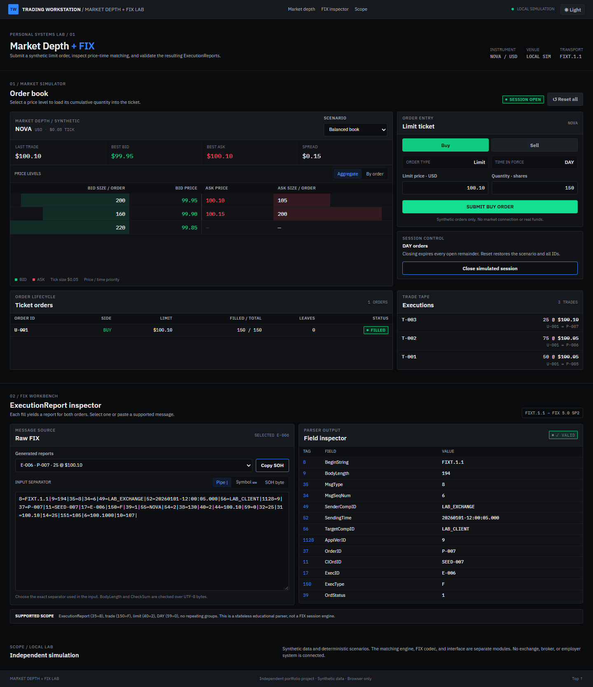

# Market Depth + FIX Lab

A standalone, browser-only portfolio demo built with React, TypeScript, and Vite. It uses synthetic orders to show limit order matching and parses its own FIX ExecutionReports. No exchange, broker, employer system, API, or live market feed is connected.



## Run locally

Requirements: Node.js 20.19+ or 22.12+ and npm.

```bash
npm install
npm run dev
```

Open the local URL printed by Vite. For verification:

```bash
npm test
npm run build
npm run preview
```

On Windows with Microsoft Edge installed, `npm run test:browser` checks the rendered desktop and mobile flows against the running Vite server and writes screenshots to `preview/`.

## Architecture

- `src/domain/market.ts`: deterministic scenario seeds, integer-cent prices, $0.05 tick validation, order identity, price-time matching, depth projections, trade and order state, DAY close.
- `src/fix/executionReport.ts`: FIXT.1.1 / FIX 5.0 SP2 ExecutionReport encoder and parser. Both BodyLength and CheckSum use UTF-8 bytes. The parser produces the fields displayed by the inspector.
- `src/ui/App.tsx`: workstation, ticket, order lifecycle, trade tape, report selector, paste editor, validation feedback, and reset.
- `src/ui/styles.css`: responsive presentation, including narrow screen layouts.
- `src/design-system/`: portable Obsidiana and Claro tokens plus the button, field, input, select, segmented control, status, and numeric primitives used by the UI. The values and semantic rules follow the owner's personal Trading Workstation design system.

The domain and FIX modules contain no React state or browser storage. A reset recreates the selected seed and clears IDs, executions, selected report, and editor content. Switching scenario does the same. All event times and IDs are deterministic. The compact UI offers Obsidiana and Claro themes; the preference is stored locally. IBM Plex Sans and Mono fonts ship with the bundle, so the interface needs no font CDN.

Page and panel scrollbars use the active theme's surface and border tokens. Native controls also receive the matching dark or light color scheme.

## Demo script

1. Start with **Balanced book**. Switch between **Aggregate** and **By order** to see that the $100.05 ask contains two separate passive orders, `P-005` and `P-006`.
2. Submit the default **Buy 150 @ $100.10**. Three trades consume 50 and 75 shares at $100.05, then 25 at $100.10. The incoming `U-001` fills completely; `P-007` retains 105 shares.
3. In **Generated reports**, select `E-005` for `U-001`. The inspector shows `LastQty=25`, `LastPx=100.10`, `CumQty=150`, `AvgPx=100.0583`, and `LeavesQty=0`.
4. Edit a byte in **Raw FIX**. The parser displays a CheckSum error. Restore it by reselecting the report. Use **Copy SOH** and change the separator mode to **SOH byte** before pasting if you want to inspect the wire delimiter.
5. Choose **Thin offer** and submit its default ticket to see a partially filled order rest in the book. Close the simulated session to expire its remainder; **Reset all** restores the seed and counters.

## Supported FIX subset

The generator emits one trade ExecutionReport for **each participating order per trade**. Thus one match yields two reports: an aggressor report and a passive report. `ExecID` and `MsgSeqNum` are unique within the simulated run. It emits only `35=8`, `150=F`, `40=2`, `59=0`, `1128=9`, with `8=FIXT.1.1`. `39` is `1` for a partial fill and `2` for a complete fill. `32/31` describe the latest fill; `14/6/151` describe cumulative order state. The parser accepts SOH (`0x01`), pipe (`|`), or the visible SOH symbol (`␁`) only when the corresponding mode is selected. It validates supported tags, required fields, duplicates, ordering, basic enum and numeric formats, quantity consistency, BodyLength, and CheckSum.

The parser is intentionally narrow. It rejects unknown tags and repeating groups. It does not handle other FIX message types, session negotiation, resend/sequence recovery, encryption, encoded data, components, repeating groups, cancellation or expiration reports, multi-message streams, or a full FIX dictionary. ASCII field values are the only supported payload values. The deterministic timestamp is for the demo, not a live clock. The simulator has one synthetic instrument, limit orders, and DAY validity only; it has no order cancel/replace, auction, fees, market orders, persistence, Go backend, WebSocket, or Kafka.

## Provenance

The existing portfolio's Trading Lab and FIX explorer informed the feature scope. This project reimplements the engine, FIX codec, and interface independently. Its portable UI primitives adapt the owner's personal Trading Workstation design system, with brand blue reserved for identity/focus and trading green/red reserved for market semantics. The `NOVA` instrument, book, messages, times, and identifiers are synthetic. No employer material, logs, images, configurations, or documentation are included.
